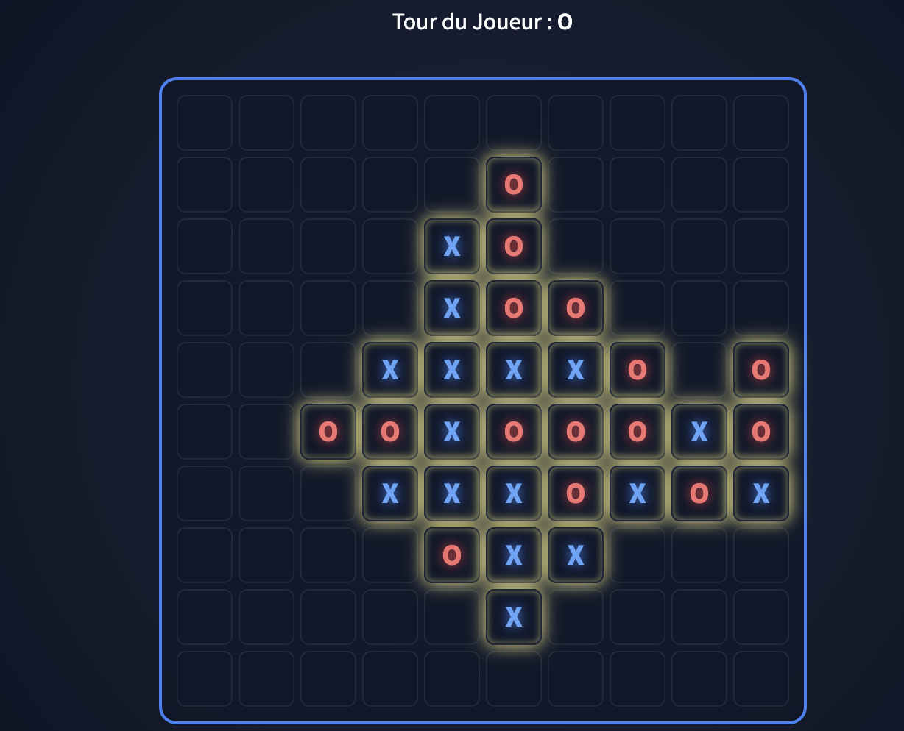

# 916 LLM vs LLM — 10×10 Tic-Tac-Toe (Gomoku-style)

A Tic-Tac-Toe game on a **10×10** grid where two **LLMs** play against each other, move by move. The UI is built with **Streamlit**, the backend with **FastAPI**, and the models are hosted on **Azure OpenAI**.

---

## 🎮 Game rules

| Setting | Value |
|--------|-------|
| Board | 10 × 10 |
| Players | X (Blue) vs O (Red) |
| Win condition | 5 tokens in a row (horizontal, vertical, diagonal) |
| Draw | Full board with no winner |

---

## 📂 Project structure

```
tictactoe/
├── api.py             # FastAPI backend (endpoints, Azure call, move parsing)
├── app_streamlit.py   # Streamlit user interface
├── game.py            # Game engine (board, moves, win/draw detection)
├── models_config.py   # Available Azure model configuration
├── prompt.py          # Prompt construction sent to the LLM
├── style.css          # CSS styles for the board
├── requirements.txt   # Python dependencies
└── Procfile           # Process start (API + Streamlit)
```

---

## 🤖 Available models

| Label | Azure deployment |
|------|-------------------|
| GPT-4o | `morpion-openai` |
| gpt-4.1-mini | `morpion-mini` |

---

## ⚙️ Installation

```bash
# Clone the repo
git clone https://github.com/asma-tk/tictactoe.git
cd tictactoe

# Create a virtual environment
python -m venv venv
source venv/bin/activate

# Install dependencies
pip install -r requirements.txt
```

### Required environment variables

```bash
export AZURE_OPENAI_ENDPOINT="https://<your-resource>.openai.azure.com"
export AZURE_OPENAI_KEY="<your-key>"
export AZURE_OPENAI_API_VERSION="2024-02-15-preview"  # optional
```

---

## 🚀 Run

```bash
# Terminal 1 — FastAPI API
uvicorn api:app --reload --port 8000

# Terminal 2 — Streamlit UI
streamlit run app_streamlit.py
```

Or use the `Procfile` if you run a process manager (e.g., `honcho`).

---

## 🤖 Game engine (`game.py`)

| Method | Description |
|--------|-------------|
| `reset()` | Resets the board and sets the current player back to X |
| `valid(r, c)` | Checks that a move is inside the board and on an empty cell |
| `play(r, c)` | Plays a move (if valid) and switches the current player |
| `winner()` | Detects a winner in 4 directions |
| `draw()` | Draw when the board is full and there is no winner |
| `fallback_move()` | Fallback strategy: choose an empty cell near the center |

---

## 🖥️ Streamlit interface

- **Restart Game**: resets the match
- **Play AI Move**: makes the current player’s LLM play
- **Auto**: automatic mode — both LLMs play continuously
- **Speed**: delay between moves in auto mode (0.05s → 1s)
- Choose a different model independently for **X** and **O**

---

## 👤 Author

**Asma Taberko**
